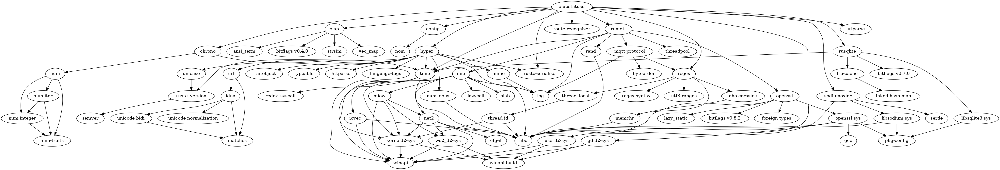

# Description
Implements a status API for hackerspaces. Most actions require authentication
(HTTP Auth with a common password). Also supports announcements (for events or
people announcing their future stay) and presence (people currently staying).

What data the daemon tracks and how the API looks is documented in the [Specification](api-specification.md).

As of 0.2.0 clubstatusd can publish status and presence changes via MQTT.

# Dependencies
* Rust and Cargo
* GCC
* OpenSSL and SQLite3 (with headers)
on Debian: `apt-get install gcc openssl libssl-dev sqlite3-0 sqlite3-dev`, use
binary installer on https://www.rust-lang.org/downloads.html

# Build
Build dependencies: Rust and Cargo

To build, run `cargo build --release`

# Dependency Graph

